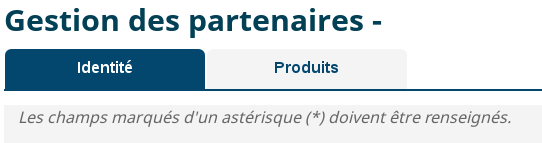

# Les composants de Tabs

## Description

Tous les éléments d’onglet `Tabs` et  `Tab` sont chargés dans la page, l’affichage sous forme d’onglet est ensuite réalisé si le JavaScript est activé. Un composant d’onglet consiste en une liste de liens qui ciblent des éléments de contenu.



## Utilisation

Les balises de type `Tab` sont englobées par une balise de type `Tabs`,
Les balises `TabHeader` et `TabContent` sont engloblées par une balise de type `Tabs` et sont optionnelles,
Un `Tab` ne peut avoir qu'un seul TabHearder et 1 seul TabContent:

```javascript
<Tabs>
    <Tab>
    </Tab>
    <Tab>
    </Tab>
    <Tab>
        <TabHeader>
        </TabHeader>
        <TabContent>
        </TabContent>
    </Tab>
    ...
</Tabs>
```

Les attributs du composant `Tabs` sont les suivants:

| attribut         | description                                         | valeur par défaut                                |
| ---------------- | --------------------------------------------------- | ------------------------------------------------ |
| panelId          | Préfixe des id's de chaque div contenant l'onglet   | panel                                            |
| selectedTabIndex | Index de l'onglet à afficher                        | 0                                                |
| beforeHideTab    | Méthode appelée avant le masquage d'un onglet       |                                                  |
| afterShowTab     | Méthode appelée après l'affichage d'un onglet       |                                                  |

Les attributs du composant `Tab` sont les suivants:

| attribut         | description                                                     | valeur par défaut                                |
| ---------------- | --------------------------------------------------------------- | ------------------------------------------------ |
| forceRender      | Définit si l'onglet sera rendu de force ou non (depreceated)    |                                                  |
| isVisible        | Définit si l'onglet est visible ou non                          |                                                  |
| mount            | Définit la méthode de chargement de l'onglet                    | true                                             |
| onSelect         | Méthode appelée lorsque l'onglet est sélectionné ou sélectionné |                                                  |
| panelId          | Id du contenu de l'onglet                                       | panel                                            |
| prefixId         | Préfixe de l'identifiant de la section                          |                                                  |
| title            | Titre de l'onglet                                               |                                                  |

Les attributs du composant `TabHeader` sont les suivants:
Elle permet de surcharger le titre de l'onglet.

| attribut         | description                                                   | valeur par défaut                                |
| ---------------- | ------------------------------------------------------------- | ------------------------------------------------ |
| aucun            | ------------------------------------------------------------- | ------------------------------------------------ |
| ---------------- | ------------------------------------------------------------- | ------------------------------------------------ |

Les attributs du composant `TabContent` sont les suivants:
Permet de lier l'état (in progress/idle) d'un datasource à celui de l'onglet (intéressant pour synchroniser le loader de l'onglet automatiquement).

| attribut              | description                                                   | valeur par défaut                                |
| --------------------- | ------------------------------------------------------------- | ------------------------------------------------ |
| dataSource            | DataSource                                                    | none (optionnel)                                 |


Les méthodes du composant `Tabs` sont les suivants:

| méthodes                | description                                                                                            |  Paramètres                                      |
| ----------------------- | ------------------------------------------------------------------------------------------------------ | ------------------------------------------------ |
| addElements             | Permet d'ajouter des elements Tab                                                                      | position: number, ...tabsToAdd: JSX.Element[]    |
| removeElementsById      | Permet de supprimer des Tab en fonction des Id                                                         | ids: number[]                                    |
| removeElementsByIndex   | Permet de supprimer des Tab en fonction des index                                                      | indexes: number[]                                |
| getCurrentIndexSelected | Renvoie l'index du tab courrant                                                                        | none                                             |
| refresh                 | Force le rafraîchissement du tabs (uniquement lorsqu'on ajoute/supprime un composant dans un tab)      | none                                             |


Dans notre exemple, le formulaire est inclus dans le premier des deux onglets.

```javascript

<Tabs id="exemple-tabs" selectedTabIndex={0}>
    <Tab title="Identité" >
        <Form ...>
            ...
        </Form>
   	</Tab>
    <Tab titre="Produits">
        <h5>Liste des produits</h5>
    </Tab>
</Tabs>
```

## Live coding

```javascript showroom

return (
    <Tabs id="tabsExemple" selectedTabIndex={0}>
        <Tab title={"Onglet 1"}>
        </Tab>
        <Tab title={"Onglet 2"}>
        </Tab>
    </Tabs>
 );
```

```javascript

<Tabs id="exemple-tabs" selectedTabIndex={0}>
    <Tab title="Identité" >
        <Form ...>
            ...
        </Form>
   	</Tab>
    <Tab titre="Produits" mount={false}>
        <h5>Liste des produits</h5>
    </Tab>
</Tabs>
```
