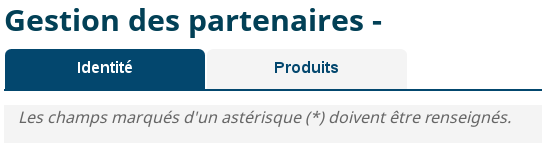

# Les composants de Tabs



## Utilisation

Les balises de type `TabPanels` et `TabList` sont englobées par une balise de type `TabsLite`,
Les balises `TabPanel` sont engloblées par une balise de type `TabPanels`, elles permettent de définir le contenu d'un tab
Les balises `TabListItem` sont engloblées par une balise de type `TabList`, elles permettent de définir le header d'un tab
Un `Tab` ne peut avoir qu'un seul `TabPanel` et 1 seul `TabListItem`:

```javascript
import  { TabsLite } from "hornet-js-react-components/src/widget/tab/lite/tabs-lite";
import  { TabListItem } from "hornet-js-react-components/src/widget/tab/lite/tab-list-item";
import  { TabList } from "hornet-js-react-components/src/widget/tab/lite/tab-list";
import  { TabPanel } from "hornet-js-react-components/src/widget/tab/lite/tab-panel";
import  { TabPanels } from "hornet-js-react-components/src/widget/tab/lite/tab-panels";

<TabsLite>
    <TabList>
        <TabListItem>
            <div> Header tab 1 </div>
        </TabListItem>
        <TabListItem>
            <div> Header tab 2 </div>
        </TabListItem>
    </TabList>
    <TabPanels>
        <TabPanel>
            <div> content tab 1 </div>
        </TabPanel>
        <TabPanel>
            <div> content tab 2 </div>
        </TabPanel>
    </TabPanels>
</TabsLite>
```

Les attributs du composant `TabsLite` sont les suivants, les attributs Html seront également disponibles:

| Attribut         | Description                                         | Obligatoire | Valeur par défaut                   | Type   |
| ---------------- | --------------------------------------------------- | ------------| ------------------------------------|--------|
| defaultTab       | onglet actif par defaut                             | &nbsp;      | &nbsp;                              | number |
| activeTab        | onglet actif (gestion controllée des onglets)       | &nbsp;      | &nbsp;                              | number / string |
| onTabChange      | fonction appelée au changement du tab               | &nbsp;      | &nbsp;                              | (newTabIndex: number) => void |
| description      | description du tabs                                 | &nbsp;      | &nbsp;                              | string |
| beforeHideTab    | Méthode appelée avant le masquage d'un onglet       | &nbsp;      | &nbsp;                              | (index?: number) => void |
| afterShowTab     | Méthode appelée après l'affichage d'un onglet       | &nbsp;      | &nbsp;                              | (index?: number) => void |
| addTabFunction   | Méthode appelée lors d'un click sur le bouton d'ajout d'onglet | &nbsp; | &nbsp;                        | void/Function |
| addButtonTtitle  | Title du buton d'ajout d'onglet                     | &nbsp;      | &nbsp;                              | string |
| deleteTabFunction| Méthode appelée lors d'un click sur le bouton de suppression d'un onglet | &nbsp; | &nbsp;              | void/Function |
| deleteButtonTitle| Title du buton de suppression d'un onglet           | &nbsp;      | &nbsp;                              | string |

Lorsque `activeTab` est défini, les onglets ne seront plus controllés par le composant, ce sera a l'application de gérer l'onglet actif.

Les attributs du composant `TabList` sont les suivants, les attributs Html seront également disponibles:

| Attribut         | Description                                                     | Obligatoire | valeur par défaut                                |Type      |
| ---------------- | --------------------------------------------------------------- |  -----------| ------------------------------------------------ |----------|
| onTabClick       | Méthode appelée lors d'un click sur un tabListitem              | &nbsp;      | &nbsp;                                           | (index: number) => void  |
| onTabKeyDown     | Méthode appelée lors d'un click sur une touche                  | &nbsp;      | &nbsp;                                           | (index: number) => void  |
| activeTab        | onglet actif        | &nbsp;      | &nbsp;                              | number / string |
   

Les attributs du composant `TabListItem` sont les suivants, les attributs Html seront également disponibles:
Elle permet de surcharger le titre de l'onglet.

| Attribut         | Description                                                   | Obligatoire | Valeur par défaut                                |Type|
| ---------------- | ------------------------------------------------------------- | ------------| ------------------------------------------------ |----|
| name        | nom du composant        | &nbsp;      | &nbsp;                              | string |
| isActive        | indique si le tab est actif        | &nbsp;      | &nbsp;                              | boolean |
| isDeletable        | indique si le tab est supprimable        | &nbsp;      | &nbsp;                              | boolean |
| deleteTabFunction| Méthode appelée lors d'un click sur le bouton de suppression d'un onglet | &nbsp; | &nbsp;              | void/Function |
| deleteButtonTitle| Title du buton de suppression d'un onglet           | &nbsp;      | &nbsp;                              | string |


Les attributs du composant `TabPanels` sont les suivants, les attributs Html seront également disponibles:
| Attribut              | Description                                                   | Obligatoire | Valeur par défaut                                | Type |
| --------------------- | ------------------------------------------------------------- | ------------| ------------------------------------------------ |------|
| activeTab        | onglet actif        | &nbsp;      | &nbsp;                              | number / string |


Les attributs du composant `TabPanel` sont les suivants, les attributs Html seront également disponibles:
| Attribut              | Description                                                   | Obligatoire | Valeur par défaut                                | Type |
| --------------------- | ------------------------------------------------------------- | ------------| ------------------------------------------------ |------|
| divId            | identifiant du composant                                                    | &nbsp;      |  &nbsp;                                  |string |
| isActive        | indique si le tab est actif        | &nbsp;      | &nbsp;                              | boolean |
| index        | Index du tab        | &nbsp;      | &nbsp;                              | number |


Les méthodes du composant `TabsLite` sont les suivantes:

| méthodes                | description                                                                                            |  Paramètres                                      |
| ----------------------- | ------------------------------------------------------------------------------------------------------ | ------------------------------------------------ |
| setActiveTab            | change l'onglet actif                                                                                  | index: number - onglet à activer                 |
| setFocusOnTab           | mets le focus sur l'onglet actif                                                                       |                                                  |
| getTabsRef              | retourne les références des tabListItem                                                                |                                                  |
| getTabsPanelRef         | retourne les références des tabPanel                                                                   |                                                  |


Dans notre exemple, le formulaire est inclus dans le premier des deux onglets.

## Live coding

```javascript showroom

return (
    <TabsLite>
        <TabList>
            <TabListItem>
                <div> Header tab 1 </div>
            </TabListItem>
            <TabListItem>
                <div> Header tab 2 </div>
            </TabListItem>
        </TabList>
        <TabPanels>
            <TabPanel>
                <div> content tab 1 </div>
            </TabPanel>
            <TabPanel>
                <div> content tab 2 </div>
            </TabPanel>
        </TabPanels>
    </TabsLite>
 );
```
