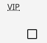
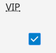
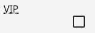
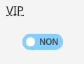
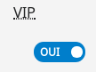

# Le composant CheckBoxField

Manuel d'utilisation du composant `CheckBoxField`.

## Utilisation

Le composant `CheckBoxField` est utilisable dans un formulaire.

```javascript
import { Form } from "hornet-js-react-components/src/widget/form/form";
import { CheckBoxField } from "hornet-js-react-components/src/widget/form/checkbox-field";

render(): JSX.Element {
    return(
        <div>
            <Form ...>
                <CheckBoxField
                 name="exempleCheckbox"
                 label={"VIP"}
                />
            </Form>
        </div>
    );
}
```

Aperçu :



Cochée:



Le composant possède les propriétés des interfaces:

[HornetClickableProps](/hornetshowroom/composant/page/hornet-js/composants/proprietes-hornet-component)

[HornetBasicFormFieldProps](/hornetshowroom/composant/page/hornet-js/composants/proprietes-hornet-component)

Attributs du composant `CheckBoxField` :

| Attribut       | Description                                                   | Obligatoire       | Valeur par défaut | Type       |
| -------------- | ------------------------------------------------------------- | ----------------- |------------------ |----------- |
| currentChecked | Si oui ou non la case est cochée                              | &nbsp;            | &nbsp;            | boolean    |
| label          | Libellé du champ de saisie de date                            | &nbsp;            | &nbsp;            | string     |
| inline         | Type d'affichage du champs                                    | &nbsp;            | CheckBoxField.Inline.NONE | CheckBoxField.Inline |
| labelOnOff     | Label affiché en mode switch (format: {"on" : "", "off": ""}) | &nbsp;            | &nbsp;            | any        |
| required       | Indique si la saisie du champ est obligatoire pour valider le formulaire | &nbsp; | false             | boolean    |
| swicth         | Si le champs est un switch ou non                             | &nbsp;            | false             | boolean    |


le champ dispose également d'un attribut inline qui permet de définir comment est affichée la case:

```javascript
<CheckBoxField
 name="exempleCheckbox"
 label={"VIP"}
 inline={CheckBoxField.Inline.ALL}
/>
```




L'attribut switch permet de définir si le champ sera affiché sous forme de switch :

```javascript
<CheckBoxField
 name="exempleCheckbox"
 label={"VIP"}
 switch={true}
/>
```



coché:



L'attribut `labelOnOff` permet de définir les label du switch.
Son format est : {"on":"", "off":""} :

```javascript
...
<CheckBoxField
 name="exempleCheckbox"
 label={"VIP"}
 switch={true}
 labelOnOff={{"on":"On", "off":"Off"}}
/>
```

## Live coding

```javascript showroom
    return (
        <CheckBoxField
            name="exempleCheckbox"
            label={"VIP"}/>
    );
```