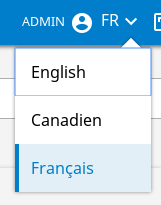
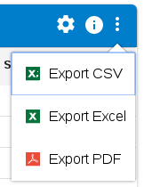
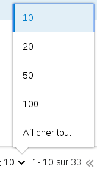
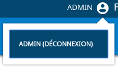
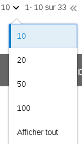
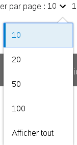
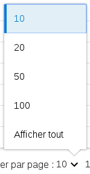

# Le composant Dropdown

## Description

Le composant `Dropdown` affiche un bouton textuel ou en forme d'icône qui, au clic, ouvre un menu déroulant.
Dans l'application tutoriel, le Dropdown est utilisé à différents endroits :

| Le module d'internationalisation | Le menu action du tableau | le pager du tableau | Module d'identification |
| -------------------------------- | -------------------------------- | -------------------------------- |-----|
|  | | | |

## Fonctionnement


| Attribut         | Description                                         | Obligatoire |Valeur par défaut |  Type           |
| ---------------- | --------------------------------------------------- | ------------| -----------------|-----------------|
| ariaLabel       | Valeur de aria-label pour l'accessibilité           ||                   | String               |
| className        | Classname Css pour l'affichage                      ||                   | String               |
| closeClick       | Cache ou non le dropdown après le click sur un item || True              | Boolean              |
| disabled         | Activé ou désactivé un item                         || False             | Boolean              |
| drawArrow        | Affiche ou non la flèche sur le dropdown déroulé    || True              | Boolean              |
| icon             | Classe Css pour l'affichage d'un icon en Bouton     ||                   | String               |
| id               | Id du composant                                     ||                   | String               |
| items            | Liste des différentes options possibles             ||                   | any              |
| label            | Label du composant ("Affichage")                    ||                   | String               |
| labelClassName   | Style css du label                                  ||                   | String               |
| onClick          | Méthode appelée lors d'un click sur le dropdown     |||React.MouseEventHandler<HTMLInputElement>|
| position         | La position du dropdown déroulé                     || Position.BOTTOMRIGHT       | Enum Position : BOTTOMLEFT, BOTTOMRIGHT, TOPLEFT, TOPRIGHT  |
| valueCurrent     | Valeur qui est sélectionnée                         ||                   | Number               |
| title            | Titre du dropdown                                   ||                   | String               |
| type             | Détermine si l'élement est affiché comme un button  ||                   | String               |

Voici les différentes positions pour le Dropdown déroulé: 

| Bottom Left(BL) | Bottom Right(BR) | Top Left(TL) | Top Right(TR) |
| -------------------------------- | -------------------------------- | -------------------------------- |-----|
|  | | | |

Chaque position fait appel ensuite à une classe spéciale afin de position correctement la box Dropdown.

| Enum Position |  ClassName |
|---------------|------------|
| Position.BOTTOMRIGHT | position-bottom-right |
| Position.BOTTOMLEFT  | position-bottom-left |
| Position.TOPLEFT | position-top-left |
| Position.TOPRIGHT | position-top-right |

## Utilisation

Le composant dropdown utilise un autre composant : `dropdown-item`.

### Dropdown-Items
Il faut créer une liste des items du dropdown qui contiendra plusieurs attributs :

| Attribut         | Description                                         | Obligatoire |Valeur par défaut           |Type |
| ---------------- | --------------------------------------------------- | ------------|--------------------------- |-----|
| action           | La fonction javascript à exécuter en cas de clics   ||                             |Function|
| className        | Le style css de l'item                              ||                             |string|
| disabled         | Activer ou non l'item                               ||                             |boolean|
| getRef           | Fonction de gestion de la ref                       |||Function|
| handleKeyDown    | Fonction appelée lors de l'evennement onKeyDown     |||Function|
| label            | Label de l'item                                     ||                             |string|
| lang             | Langue du dropdown item                             |||string|
| srcImg           | Chemin du logo pour l'item                          ||                             |string|
| url              | Une url pour la navigation en cas de clique         ||                             |string|
| valueCurrent     | Valeur qui est sélectionnée                         ||                   | Number |

Enfin, si l'on désire voir quel item est actif, il ne faut pas oublier de créer la condition pour changer l'attribut `disabled`.

```javascript
let disabled = false;
    
if(this.state.currentLanguage.toUpperCase() == item.langShort)
{
    disabled = true;
}
```

Voici un exemple de code complet qui liste les différentes langues avec désactivation de la langue déjà selectionnée.
```javascript
import { Dropdown, Position } from "src/widget/dropdown/dropdown";

let dropdownItems = [];

this.state.listLanguage.map((item)=>{
    let disabled = false;
    /* test si l'item est actif ou non */
    if(this.state.currentLanguage.toUpperCase() == item.langShort)
    {
        disabled = true;
    }
    dropdownItems.push({
        label: item.langLabel,
        action: this.selectLanguage.bind(this, item.locale,item.langShort),
        className: "material-dropdown-menu__link",
        srcImg: propsButtons.srcImg,
        url: propsButtons.url ? this.genUrlWithParams(propsButtons.url, item || {}) : null,
        disabled: disabled
    });
});
<Dropdown
    className={"language"}
    id={"Change-Langauge"}
    items={dropdownItems}
    icon="language-arrow-down"
    value={this.state.currentLanguage.toUpperCase()}
    position={this.props.position}
/>
```

## Live coding 

```javascript showroom
const divStyle = {
  width: '146px',
  backgroundColor:'#007ecb',
  color: 'white'
};

return (
  <div style={divStyle} >
    <Dropdown
        items={[{label: "monItem1", action: () => {alert('click item 1')}, className:"link"},{label: "monItem2", action: () => {alert('click item 2')}, className:"link"}]}
        icon="picto-user"
        id={"mondropdown-drop"}
        label={"Mon dropdown"}
        position={Position.BOTTOMLEFT}
    />
    </div>
);

```
