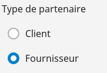
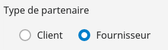
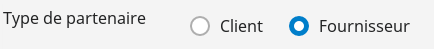
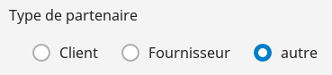

# Le composant RadiosField

Manuel d'utilisation du composant `RadiosField` Hornet.

## Utilisation

Le composant `RadiosField` est utilisable dans un formulaire.

```javascript

import { Form } from "hornet-js-react-components/src/widget/form/form";
import { RadiosField } from "hornet-js-react-components/src/widget/form/radios-field";

/** Référence vers le composant calendrier : nécessaire pour utiliser la fonction setAttribute(). */
private exampleRadio: RadiosField;

constructor(...) {
    /**
    * valeurs présentes dans le radioField
    */
    this.data = [
        {"value": "true", "label": "Client"},
        {"value": "false", "label": "Fournisseur"}
    ];
}

render(): JSX.Element {
    return(
        <div>
            <Form ...>
                <RadiosField
                  name="exampleRadio"
                  label={"Type de partenaire"}
                  dataSource={this.data}
                  currentChecked={true}
                />
            </Form>
        </div>
    );
}
```

Aperçu :



Le composant possède les propriétés des interfaces:

[HornetClickableProps](/hornetshowroom/composant/page/hornet-js/composants/hornet-component-props)

[HornetBasicFormFieldProps](/hornetshowroom/composant/page/hornet-js/composants/hornet-component-props)

[HornetComponentDatasourceProps](/hornetshowroom/composant/page/hornet-js/composants/hornet-component-props)

[HornetComponentChoicesProps](/hornetshowroom/composant/page/hornet-js/composants/hornet-component-props)

Attributs du composant RadiosField :

| Attribut | Description | Obligatoire |Valeur par défaut | Type |
| -------- | ----------- | --------- |----------------- |--------- |
| id | Information optionnelle, valorisée par le name si non indiquée | ||string|
| defaultValue | Indique et définit si la valeur par défaut selectionné | ||any|
| dataSource | Données des boutons radio, format: {{"value":"", "label":""}...}|| |Datasource|
| data | Données des boutons radio en ne passant pas par un Datasource| ||any|
| label | Libellé du champ de saisie de date |  ||string|
| name  | Nom du radio field | ||string|
| required | Indique si la saisie du champ est obligatoire pour valider le formulaire || false |boolean|

le champ dispose également d'un attribut inline qui permet de définir comment sont affichés les boutons:

```javascript
...
<RadiosField
  name="exampleRadio"
  label={"Type de partenaire"}
  dataSource={this.data}
  defaultValue={this.data[0]}
  inline={RadiosField.Inline.FIELD}
/>
...
```




```javascript
...
<RadiosField
  name="exampleRadio"
  label={"Type de partenaire"}
  dataSource={this.data}
  defaultValue={this.data[0]}
  inline={RadiosField.Inline.ALL}
/>
...
```



la valeur RadiosField.Inline.NONE est la valeur par defaut.


Autre exemple d'utilisation:

```javascript
import { Form } from "hornet-js-react-components/src/widget/form/form";
import { RadiosField } from "hornet-js-react-components/src/widget/form/radios-field";

constructor(...) {
    /**
    * valeurs présentes dans le radioField
    */
    this.data = [
        {"value": "1", "label": "Client"},
        {"value": "2", "label": "Fournisseur"}
        {"value": "3", "label": "autre"}
    ];
}

render(): JSX.Element {
    return(
        <div>
            <Form ...>
                <RadiosField
                 name="exampleRadio"
                 label={"Type de partenaire"}
                 dataSource={this.data}
                 defaultValue={this.data[1]}
                 inline={RadiosField.Inline.FIELD}
                />
            </Form>
        </div>
    );
}

```



## Live coding

```javascript showroom
	var dataSource = new DataSource<any>([
                {"value": "1", "label": "Client"},
                {"value": "2", "label": "Fournisseur"}
                {"value": "3", "label": "autre"}]);
	return (
            <RadiosField
             name="exampleRadio"
             label={"Type de partenaire"}
             dataSource={dataSource}
             inline={RadiosField.Inline.FIELD}
            />
    );
```