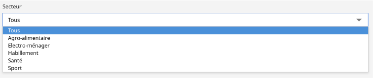

# Le composant SelectField

Liste de choix d'un formulaire

## Description

Le composant `SelectField` permet de proposer une liste de choix à l'utilisateur.




## Utilisation

```javascript

import { InputFileField } from "hornet-js-react-components/src/widget/form/input-field";

render(): JSX.Element {
    return(
    <div>
        <Form>
             <Row>
                 <SelectField name="criteres.idSecteur"
                    label={intlMessages.fields.criteres.idSecteur.label}
                    dataSource={this.dataSourceSecteurs} />
            </Row>
        </Form>
    </div>
    );
}

```

Tous les attributs standards de la balise html select peuvent être utilisés.
Les principaux attributs:

| attribut                | description                     |
| ----------------------- | --------------------------------|
| label                   | Libellé                         |
| dataSource              | Liste des options               |


## Live coding

```javascript showroom

let options = [
       {id: 1, libelle: "option 1"},
       {id: 2, libelle: "option 2"},
       {id: 3, libelle: "option 3"},
       {id: 4, libelle: "option 4"},
   ];

let dataSourceOption = new DataSource<any>(options, {value: "id", label: "libelle"});

return  (
       <SelectField
          name= {"optionlist"}
          label= {"liste d'option"}
          dataSource= {dataSourceOption}
      />
 );
```