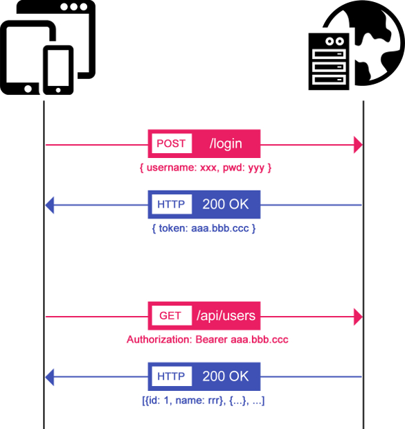

# Sécurisation des services.

## JSON Web tokens

Le principe est simple, après s’être authentifié, le serveur génère un hash de plus de 100 caractères qui servira de signature pendant une certaine durée. Ce token va ensuite transiter dans chaque requête entre le client et le serveur (NodeJs et Tomcat 8.x). Pas de cookie ni de session serveur. De plus, cette solution est applicable pour tout type de plateforme et peut permettre à une API d’être utilisée par des applications natives, des applications web…

On a la possibilité de générer un token différent pour chaque requête.

Un JWT est simplement constitué de trois parties séparées par un point : __part1.part2.part3.__

### part1 : Le header encodé en base64

Le header contient un objet javascript indiquant l’algorithme utilisé pour `hasher` le contenu.

__exemple:__ { « typ »: « JWT », « alg »: « HS256 » } ⇒ eyJhbGciOiJIUzI1NiIsInR5cCI6IkpXVCJ9 (en base64)

### part2 : Le contenu encodé en base64 (JWT claims)

Le contenu est un simple objet avec les informations à échanger entre le client et le serveur (expiration du token, identité de l’utilisateur connecté, …). On peut y placer librement des champs personnalisés et propres à nos besoins (public claims) et des attributs réservés définis dans la spécification (registered claims).

__Quelques « registered claims » :__

- iss : Origine du token (issuer),
- sub : Sujet (subject),
- exp : Date d’expiration du token (expiration),
- iat : Date de création du token (issued at),
- …

__exemple:__ { « iss »: « ekino.com », « name »: « John Doe », « admin »: true } ⇒ eyAiaXNzIjogImVraW5vLmNvbSIsICJuYW1lIjogIkpvaG4gRG9lIiwgImFkbWluIjogdHJ1ZSB9 (en base64)

### part3 : La signature

Pour générer la signature, on concatène le header et le contenu puis on encode avec l’algorithme défini dans le header.

__exemple:__

HMACSHA256(eyJhbGciOiJIUzI1NiIsInR5cCI6IkpXVCJ9 + « . » + eyAiaXNzIjogImVraW5vLmNvbSIsICJuYW1lIjogIkpvaG4gRG9lIiwgImFkbWluIjogdHJ1ZSB9, « secret key »)




Coté __Hornet__ la génération de la clé privé se fera pour chaque projet. 

        // Générer avec ssh-keygen
        // GÉNÉRER LA CLÉ PRIVÉE au format PKCS#1
        openssl genrsa -f4 -out private.pem 4096
        
        // EXPORTER LA CLE PUBLIC
        openssl rsa -in private.pem -outform PEM -pubout -out public.pem
        
        // EXPORTER LA CLÉ PRIVÉE au format PKCS # 8
        openssl pkcs8 -topk8 -inform pem -in private.pem -outform PEM -nocrypt -out private8.pem

## Coté serveur création du token JWT

L’authentification est mise en place avec __Spring Security__. En sortie nous aurons un token JWT avec:
- login de l'utilisateur
- Rôles de l'utilisateur
- la durée d'expiration

On utilise pour cela la classe _JwtClaims_


```java
	
	// Set expiration in the initClaims method
	JwtClaims claims = initClaims();
	// Set the userID
	claims.setSubject("userProfile");
   	// Set roles
	claims.setClaim(USER_CLAIM, this.mapper.writeValueAsString(claim));	
	 
```

On construit notre JWT token :

- signature du token
- définition de l’alghorithme de cryptage
- serialisé au format String

```java

            JsonWebSignature jws = new JsonWebSignature();
            jws.setPayload(claims.toJson());
            jws.setAlgorithmHeaderValue(AlgorithmIdentifiers.RSA_USING_SHA512);
            jws.setKey(secretKeyProvider.getPrivateKey());

            token = jws.getCompactSerialization();
            
```

On utilise ici un algorithme de hachages _SHA-512_

## Récupération des informations client depuis le token

Pour récupérer les informations client depuis le token on :

- dé-serialise le token JWT (sous forme de String)
- vérifie la signature du token
- crée une instance de UsernamePasswordAuthenticationToken représentant l’utilisateur d’un point de vue sécurité.

```java

	JwtConsumer jwtConsumer = new JwtConsumerBuilder()
                .setRequireExpirationTime()
                .setRequireSubject()
                .setExpectedAudience("myApplication")
                .setExpectedIssuer(ISSUER + ".myApplication")
                .setVerificationKey(key) // verification de la signature
                .build();

        //  Validate the JWT and process it to the Claims
        JwtClaims jwtClaims = jwtConsumer.processToClaims(token);
        System.out.println("JWT validation succeeded! " + jwtClaims);
        claim = mapper.readValue(jwtClaims.getStringClaimValue(USER_CLAIM), c);
        
```   

On filtre chaque page en fonction du rôle de chaque personne. Extrait de la classe __WebSecurityConfig__ qui hérite de la classe __WebSecurityConfigurerAdapter__. Celle-ci contient toutes les méthodes nécessaires pour configurer __SpringSecurity__. La classe doit être annotée `@Configuration` pour être prise en charge lors du démarrage du serveur et `@EnableWebSecurity` afin d’activer la sécurité des pages prises en charge par Spring MVC :


Pour pouvoir définir les __urls__ accessibles pour un __user__ il faut se pencher sur la classe __JwtAuthFilter__. Cette classe permet de captuer le `token` transmis par le client dans l'en-tête `Authorization`. Le filtre capture l'en-tête `Autorisation` et crée un __JwtAuthToken__ et le définit comme l'authentification actuelle pour la requête.

```java

    @Override
    public void doFilter(ServletRequest request, ServletResponse response, FilterChain chain) throws IOException, ServletException {
        HttpServletRequest servletRequest = (HttpServletRequest) request;
        String authorization = servletRequest.getHeader("Authorization");
        if (authorization != null && authorization.startsWith("Bearer ")) {
            JwtAuthToken token = new JwtAuthToken(authorization.replace("Bearer ", ""));
            SecurityContextHolder.getContext().setAuthentication(token);
        }
        chain.doFilter(request, response);
        
        /* suppression du contexte de securite pour rester en stateless.*/
        SecurityContextHolder.clearContext();
    }
    
```

Maintenant __Spring Security__ se doit de vérifier le jeton. Cela se fait via un __AuthenticationProvider__ que l'on vient surcharger. Le __JwtAuthenticationProvider__ reçoit l'instance d'authentification définie dans le __SecurityContext__, ici le __JwtAuthToken__ que nous avons configuré en utilisant __JwtAuthFilter__. Si le jeton est valide, on reçoit  un __JwtAuthenticatedProfile__ ou __Exception__ si celui-ci n'est pas valide.
__JwtAuthenticatedProfile__ contient les informations de profil de l'utilisateur:

```java

	@Override
	protected void configure(AuthenticationManagerBuilder auth) throws Exception {
		auth.authenticationProvider(jwtAuthenticationProvider);
	}		
		
```  
    
La méthode `configure()` prend en paramètre un objet `HttpSecurity` qui va nous permettre de définir les urls interceptées, par exemple Les pages contenues dans le dossier __/partenaires/__ sont accessibles uniquement aux utilisateurs ayant le rôle __APPLI_TUTO_ADMIN__ dans son profil.  

```java

	@Override
	protected void configure(HttpSecurity http) throws Exception {
		http.addFilterAfter(new JwtAuthFilter(), ExceptionTranslationFilter.class).sessionManagement().sessionCreationPolicy(SessionCreationPolicy.STATELESS).and()
		.csrf().disable()
		.exceptionHandling().authenticationEntryPoint(new SecurityAuthenticationEntryPoint()).accessDeniedHandler(new RestAccessDeniedHandler())
		.and().authorizeRequests()
			.antMatchers(HttpMethod.POST, "/partenaires/**").hasRole("APPLI_TUTO_ADMIN")
			.antMatchers(HttpMethod.DELETE, "/partenaires/**").hasRole("APPLI_TUTO_ADMIN")
			.antMatchers(HttpMethod.PUT, "/partenaires/**").hasRole("APPLI_TUTO_ADMIN")
			.antMatchers("/secteurs").access("hasRole('APPLI_TUTO_USER') and hasRole('APPLI_TUTO_ADMIN')")
			.anyRequest().permitAll();
	}
			
``` 

## Mise en place coté client

La partie cliente sera en charge:

- D’invoquer l’authentification de l’utilisateur en fournissant  login/password et récupérer le token JWT
- D’insérer le token JWT dans chaque requète _HTPP_ envoyée vers le serveur.
- De gérer les erreurs 4xx

