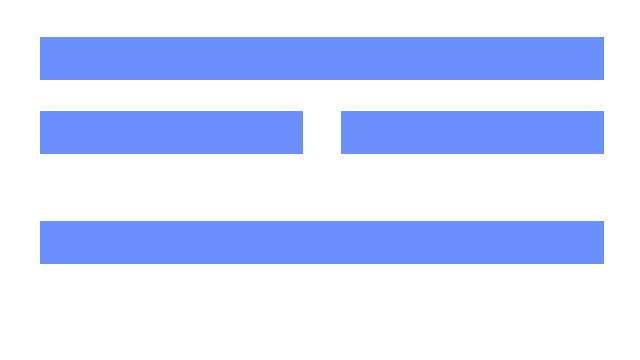
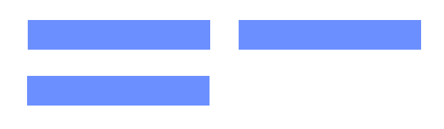

# Bonnes pratiques Ergonomie

## Ordre des boutons d'action

Avoir « OK » à gauche / « Annuler » à droite ou l'inverse, les deux sont possibles et justifiés. L'un est plus propice au tactile (et utilisé par Apple), l'autre est plus propice à la navigation clavier (et utilisé par Windows). Vous êtes libres de choisir l'ordre qui vous semble le plus adapté à vos utilisateurs.  Cependant, une fois cet ordre choisi, il devra être le même sur toutes les pages (homogénéité de l'usage).

## Langage de l'interface

Utiliser des noms ou des verbes pour les boutons d'action ?  Si c'est un verbe, le conjuguer ou non ? 
Ici encore, l'important est d'être cohérent sur la totalité de vos pages. Choisissez la tonalité de langage que vous désirez et gardez la même tout au long de l'application.

Exemple : 

- Recherche + Annuler = NON
- Recherchez + Annuler = NON, mais Rechercher+ Annuler ou Recherchez + Annulez = OUI

## Utilisation des pop-in

Une modal (ou pop-in) doit être utilisée pour y mettre du contenu court/bref et pour y faire très peu d'actions. Si le contenu est trop important, alors utilisez plutôt une nouvelle page pour y mettre le contenu.

## Utilisation des expands (accordéons)

Ne pas utiliser uniquement  des expands pour votre contenu sur une même page. Servez-vous de ce composant afin de mieux structurer l'information : affichez les informations importantes/le plus souvent utilisées en premier directement sur la page. Puis, utilisez les expands/accordéons pour y ranger le contenu secondaire/moins utilisé et donc gagner de la place et de la lisibilité sur votre page. 

## Quelques petits points importants :

- Ne jamais souligner un texte (il pourrait être confondu avec un lien)
- N'hésitez pas à apporter de l'image dans vos applications, et encore mieux : des images comportant des êtres humains (de manière pertinente). Humaniser une interface apporte des émotions positives et rends l'utilisation de l'application plus agréable pour l'utilisateur. Astuce : les applications de gestion étant moins propices à ce type d'habillage,  concentrez-vous sur la page d'accueil et/ou le header.
- Ne pas utiliser les onglets pour un processus par étape. Le système des onglets est de permettre un accès asynchrone au contenu (mais cela ne veut pas dire qu'il ne doit pas y avoir d'ordre aux onglets, classez-les par fréquence d'usage)
- Ne pas répéter de liens similaires sur une même page
- Être cohérent sur les liens : des liens libellés de la même manière doivent conduire à la même page
- Utiliser des pictos en svg pour des raisons d'accessibilité et de responsive
- Les champs d'une recherche avancée apparaissent toujours avant le bouton final d'action de recherche

## Positionnement de champs

- Il est possible de positionner jusqu’à 4 champs sur une seule ligne
- Dans tous les cas, il faut que toutes les lignes de l’écran soient composées de la même façon : soit d’un nombre pair, soit d’un nombre impair. On peut par ex, faire une ligne de 2 champs, et en dessous, une ligne de 4 petits champs :

Il est même recommandé de laisser parfois des « vides ». Cela permet de faire des pauses « visuelles » (aéré). Par contre, l’emplacement vide doit être mis en fin de ligne, et pas en début :

- Même si la fin du contenu n’est pas visible dans le champ, on peut s’autoriser à ne pas mettre un champ plus grand/large. Puisque l’utilisateur, s’il le souhaite, pourra agrandir le champ si c’est un champ texte, soit « déplacer » son curseur dans le texte d’un champ simple pour faire apparaitre la suite.
Pour savoir si cela vaut le coup de proposer un grand champ texte ou bien un simple champ de saisie, il faut estimer le nombre de cas où le texte dépassera la taille max de ces champs. Sur Evaluation, nous pouvons nous appuyer sur les données dont nous disposons déjà en base, pour connaitre la taille max que les agents saisissent, ainsi que le nombre de fois où ce cas est rencontré.
- Il est tout à fait possible (voir recommandé) de changer le thème de couleur Hornet. Cela permettrait  à l’application d’avoir sa propre identité visuelle, et serait rapidement reconnue par les agents, si la couleur est différente des autres applications Hornet.
- Si des pictogrammes sont à reprendre ou à réaliser, il faut qu’ils soient en « svg »