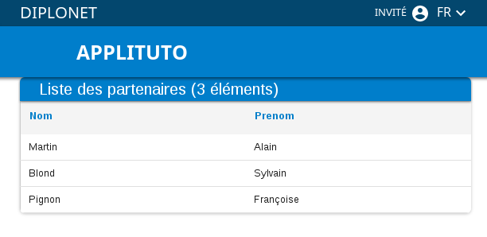

# Tutoriel Hornet-js

Objectif :

- Créer un premier écran Hornet

Fonctionnalité :

- Créer un écran qui affiche une liste de partenaires.

## Créer le projet

Créer un projet Hornet JS appeler applituto à l'aide du [template Yeoman](/hornetshowroom/composant/page/hornet-js/tutoriel/javascript/creer-un-projet)

## Création de la nouvelle page

### Ajout de la page

Cette page permettra d'afficher la liste des partenaires.

Ajout du fichier : `src/views/par/liste-partenaire.tsx`

```javascript

import { HornetPage, HornetPageProps } from "hornet-js-react-components/src/widget/component/hornet-page";
import { DataSource } from "hornet-js-core/src/component/datasource/datasource";
import * as React from "react";
import { Notification } from "hornet-js-react-components/src/widget/notification/notification";
import { Table } from "hornet-js-react-components/src/widget/table/table";
import { Header } from "hornet-js-react-components/src/widget/table/header";
import { MenuActions } from "hornet-js-react-components/src/widget/table/menu-actions";
import { Content } from "hornet-js-react-components/src/widget/table/content";
import { Columns } from "hornet-js-react-components/src/widget/table/columns";
import { Column } from "hornet-js-react-components/src/widget/table/column";
import { DataSourceConfigPage } from "hornet-js-core/src/component/datasource/config/service/datasource-config-page";

export class ListePartenairePage extends HornetPage<PartenaireService, HornetPageProps, any> {

    /** Datasource appelant le service lister */
    private datasource: DataSource<any> = new DataSource<any>( new DataSourceConfigPage(this, this.getService().lister));

    /** Tableau de liste de partenaires */
    private maTable: Table;

    prepareClient(): void {
        this.datasource.fetch(true);
    }

    render(): JSX.Element {

        /** Récupération des messages i18n*/
        const message: any = this.i18n("listePartenairePage.tableau");

        return (
            <div>
                <Notification id="notifRpaPage" />
                <Table ref={(table) => { this.maTable = table }} id="liste-partenaires" isVisible={true}>
                    <Header id={"monHeaderRPA"} title={this.i18n(message.tableTitle)}
                            showIconInfo={true}>
                    </Header>
                    <Content dataSource={this.datasource}>
                        <Columns>
                            <Column keyColumn="nom" title={message.colonnes.nom} sortable={true} hiddenable={false}/>
                            <Column keyColumn="prenom" title={message.colonnes.prenom} sortable={true} />
                        </Columns>
                    </Content>
                </Table>
            </div>
        );
    }
}
```

### Ajout des traductions

Dans les fichiers :

- `src/ressources/messages.json`
- `src/ressources/messages-fr-FR.json`

Ajouter le bloc de message suivant:

```json

  "listePartenairePage": {
   "tableau": {
      "tableTitle": "Liste des partenaires",
      "colonnes": {
        "nom": "Nom",
        "prenom": "Prénom"
      }
   }
  }
```

### Ajout de la page de destination

#### Ajout de l'url

Dans le fichier : `src/utils/urls.ts`, si elles ne sont pas déja présentes, ajouter les constantes pour générer la nouvelle url

```javascript

/** Constantes Liées aux partenaires */
export const URL_PARTENAIRE: string = "/partenaires";
export const URL_LISTER: string = "/lister";
```

#### Ajout de la route vers la page

Dans le fichier : `src/routes/routes.ts`

Ajout de l'import de URL_PARTENAIRE:

```javascript

import {
    URL_CONTACT, URL_PARTENAIRE
} from "src/utils/urls";
```

Ajout des références pour la nouvelle fonctionnalité dans la partie `/* Routes lazy */`

```javascript

this.addLazyRoutes(URL_PARTENAIRE, "par/par-routes");
```

Ajout du fichier : `src/routes/par/par-routes.ts`

La route est liée à la page précédemment créée.

```javascript

import { AbstractRoutes, PageRouteInfos } from "hornet-js-core/src/routes/abstract-routes";
import { ListePartenairePage }  from "src/views/par/liste-partenaire";
import { Roles } from "src/utils/roles";
import ProduitsActions = require("src/actions/par/par-actions");
import { URL_LISTER } from "src/utils/urls";

export default class PartenaireRoutes extends AbstractRoutes {
    constructor() {
        super();
        this.addPageRoute(URL_LISTER,
            (id) => new PageRouteInfos(ListePartenairePage, {}, PartenaireServiceImplPage)
        );
    }
}
```

## Ajout du service

### Ajout du service lié à la page

Ajout de l'interface de service : `src/services/page/par/par-service-page.ts`

```javascript

import { ServiceRequest } from "hornet-js-core/src/services/service-request";

/**
 * Interface des services pour les partenaires
 * @interface
 */
export abstract class PartenaireService extends ServiceRequest {
    abstract lister(): Promise<any>;
}
```

Ajout de l'implémentation du service : `src/services/page/par/par-service-page-impl.ts`

```javascript

import { Utils } from "hornet-js-utils";
import { Logger } from "hornet-js-utils/src/logger";
import { ServiceRequest } from "hornet-js-core/src/services/service-request";
import { PartenaireService } from "src/services/page/par/par-service-page";
import { URL_LISTER, URL_PARTENAIRE } from "src/utils/urls";

const logger: Logger = Logger.getLogger("applidemo.services.par.par-service-page-impl");

export class PartenaireServiceImpl extends ServiceRequest implements PartenaireService {

    /**
     * liste les partenaires
     * @return Promise
     */
    lister() : Promise<any> {
        logger.info("SERVICES - PartenaireServiceImpl.lister");
        return this.fetch({method : "get", url: this.buildUrl(URL_PARTENAIRE + URL_LISTER)});
    }
}
```

dans le fichier `src/views/par/liste-partenaire.tsx` ajoutez l'import:

```javascript

import { PartenaireService } from "src/services/page/par/par-service-page";
```

dans le fichier `src/routes/par/par-routes.ts` ajoutez l'import:

```javascript

import { PartenaireServiceImpl } from "src/services/page/par/par-service-page-impl";
```

### Ajout du service renvoyant les données

Nous avons besoin de contacter le service externe permettant de récupérer les informations.

#### Création du service data

Ajout de la classe abstraite du service : `src/services/data/par/par-service.ts`

```javascript

import { ServiceSecure } from "hornet-js-core/src/services/service-secure";
import { Utils } from "hornet-js-utils";
import { Response } from "superagent";

export abstract class PartenaireService extends ServiceSecure {
    abstract lister(): Promise<any>;

    saveToken(response: Response): void {
    }

    getToken(): String {
        // Ajout du token à l'envoi
        if (Utils.getContinuationStorage().get("hornet.request") &&
            Utils.getContinuationStorage().get("hornet.request").getSession() &&
            Utils.getContinuationStorage().get("hornet.request").getSession().authorizationToken) {
            return Utils.getContinuationStorage().get("hornet.request").getSession().authorizationToken;
        }
    }
}
```

Ajout du service : `src/services/data/par/par-service-impl.ts`

```javascript
import { PartenaireService } from "src/services/data/par/par-service";

export class PartenaireServiceImpl extends PartenaireService {

    lister(): Promise<any> {
        return Promise.resolve([
            {
                nom: "Martin",
                prenom: "Alain",
                role: "Administrateur"
            },
            {
                nom: "Blond",
                prenom: "Sylvain",
                role: "Utilisateur"
            },
            {
                nom: "Pignon",
                prenom: "Françoise",
                role: "Superviseur"
            }
        ])
    }
}
```


#### Ajout de l'action

L'action permet de contacter le service de la nouvelle fonctionnalité

Ajout du fichier : `src/actions/par/par-actions.ts`

```javascript

import { PartenaireService } from "src/services/data/par/par-service";
import { RouteActionService } from "hornet-js-core/src/routes/abstract-routes";
import { Utils } from "hornet-js-utils";
import { Logger } from "hornet-js-utils/src/logger";

const logger: Logger = Logger.getLogger("applidemo.actions.pro.pro-lsp-actions");

export class Lister extends RouteActionService<any, PartenaireService> {

    execute(): Promise<any> {
        logger.info("ACTION - Lister");
        return this.getService().lister();
    }
}
```

### Ajout de la route pour le service

dans le fichier `src/routes/par/par-routes.ts` ajouter les imports suivants:

```javascript

import PartenaireActions = require("src/actions/par/par-actions");
import { PartenaireServiceImpl as PartenaireServiceData} from "src/services/page/par/par-service-page-impl";
```

puis la route suivante :

```javascript

this.addDataRoute(URL_LISTER,
    (id) => new DataRouteInfos(PartenaireActions.Lister, {id: id}, PartenaireServiceData),
    "get"
);
```


## Résultat final

 La nouvelle page créée est indiquée à cette adresse http://localhost:8888/applituto/partenaires/lister .

Aperçu :


