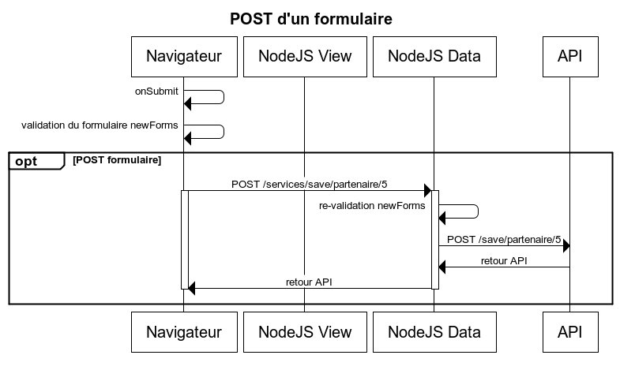

# Intégration de services REST

## Les routes et les actions

Les routes peuvent être de 2 types : les routes`vues`et les routes `data`.

Ainsi les routes `vues` sont réprésentatives de la navigation et rendent des composants React, sur le navigateur, ou retournent une page HTML, sur le serveur NodeJS.

Les routes `data` sont utilisées pour les appels de services et retournent des données json (ou flux binaires, type pdf).

La double validation se fait au niveau des routes `data` avant l'appel du service.



### Routes

Exemple de déclaration des routes :

```javascript
export class ReferentielRoutes extends AbstractRoutes {

    constructor() {
        super();

        this.addDataRoute(URL_REF_VILLES,
            () => new DataRouteInfos(ReferentielAction.ListerVilles, null, ReferentielPaysServiceImpl),
            Roles.ADMIN
        );

        this.addDataRoute(URL_PAYS,
            () => new DataRouteInfos(ReferentielAction.ListerPays, null, ReferentielPaysServiceImpl),
            Roles.ADMIN
        );

        this.addDataRoute(URL_REF_NATIONALITE,
            () => new DataRouteInfos(ReferentielAction.ListerNationalites, null, ReferentielPaysServiceImpl),
            Roles.ADMIN
        );
        
        this.addDataRoute(URL_REF_NATIONALITE + "/recherche",
            (nationnalite) => new DataRouteInfos(ReferentielAction.ListerNationalites, null, ReferentielPaysServiceImpl),
            Roles.ADMIN,
            "post"
        );
    }
}
```

### Actions

```javascript
import { Utils } from "hornet-js-utils";
import { Logger } from "hornet-js-utils/src/logger";
import { ReferentielPaysService} from "src/services/page/ref/ref-pays-service-page";
import { RouteActionService } from "hornet-js-core/src/routes/abstract-routes";

const logger: Logger = Utils.getLogger("applitutoriel.actions.ref.ref-actions");

export class ListerPays extends RouteActionService<any, ReferentielPaysService> {
    execute(): Promise<any> {
        return this.getService().listerPays()
    }
}

export class ListerVilles extends RouteActionService<any, ReferentielPaysService> {
    execute(): Promise<any> {
        logger.info("Action: ListerVilles, appel api villes");
        return this.getService().listerVilles()
    }
}

export class ListerNationalites extends RouteActionService<any, ReferentielPaysService> {
    execute(): Promise<any> {
        let payload: any = {};
        if (this.req.body) {
            payload = this.getPayload();
        }
        return this.getService().rechercherNationalites(payload.nationnalite);
    }
}
```

## API de service

Les appels aux API de services sont encapsulés dans des composants qui utilisent Superagent :

```javascript
import { Utils } from "hornet-js-utils";
import { Logger } from "hornet-js-utils/src/logger";
import { ServiceRequest } from "hornet-js-core/src/services/service-request";
import { HornetRequest, SpinnerType } from "hornet-js-core/src/services/hornet-superagent-request";
import {
    URL_REF,
    URL_PAYS,
    URL_REF_VILLES,
    URL_REF_NATIONALITE
} from "applitutoriel-js-common/src/utils/urls";
import { ReferentielPaysService } from "applitutoriel-js-common/src/services/page/ref/ref-pays-service-page";

const logger: Logger = Utils.getLogger("applitutoriel.services.par.ref-pays-service-page-impl");

/**
 * Implementation des services pour les referentiels
 * @class
 * @implements {ReferentielPaysService}
 */
export class ReferentielPaysServiceImpl extends ServiceRequest implements ReferentielPaysService {

    /**
     * liste les pays
     * Utilisé :
     * - hornet
     * @returns {Promise<object>}
     */
    listerPays() : Promise<any> {
        logger.info("SERVICES - listerPays");
        return this.fetch({method : "get", url : this.buildUrl(URL_REF + URL_PAYS), timeToLiveInCache : 3600});
    }

    /**
     * liste les nationnalités
     * Utilisé :
     * - hornet
     * - hornet-lite
     * @param {string} nationalite
     * @returns {Promise<object>}
     */
    rechercherNationalites(nationalite?: string, spinner : SpinnerType = SpinnerType.Default) : Promise<any> {
        logger.info("SERVICES - rechercherNationalites : ", nationalite);
        
        let request:HornetRequest = {method: "get", url: this.buildUrl(URL_REF + URL_REF_NATIONALITE), spinnerType: spinner};
        
        if (nationalite) {
            request.method = "post";
            request.data = {nationnalite : nationalite};
            request.url = request.url + "/recherche"
        }

        return this.fetch(request);
    }

    /**
     * liste les villes
     * Utilisé :
     * - hornet
     * @returns {Promise<object>}
     */
    listerVilles() : Promise<any> {
        logger.info("SERVICES - listerVilles");
        return this.fetch({method : "get", url : this.buildUrl(URL_REF + URL_REF_VILLES), timeToLiveInCache : 3600});
    }
}
```

La methode `fetch` prend en paramètre un objet de type `HornetRequest` pour faire appel en interne à la mèthode `getFetcher`, renvoyant l'agent de requêtage de type `HornetSuperAgent`.
Cette méthode lance la requête.

description `HornetRequest` :

| attribut | Obligatoire | Description 
|------- | ----------- | --- |
| url | X | Url de la requête |
| method | | Méthode http à utilisé (par défaut 'get');
| headers | | En-têtes à ajouter
| data | | Données
| spinnerType | | Type d'évènement Spinner à déclencher (pour les composants graphiques) (1)
| typeMine | | MediaType;
| attach | | Flux à attachés;
| noCached | | true pour ne pas mettre cette requête en cache applicatif
| timeToLiveInCache | | Durée de vie dans le cache en seconde
| cacheKey | | Algorythme de génération des clés du cache (par défaut 'url')
| cacheLinkKey | | Liste des clés à supprimer du cache (surtout utilisable avec l'algorythme url)
| progress | | Fonction à appeler lors des events progress de superagent
| ca | | Certificat
| cert | | Certificat
| key | | Certificat

(1) spinnerType permet de préciser l'évènement déclenché avant et après les appels aux services. Par défaut c'est un 'ASYNCHRONOUS_REQUEST_EVENT' (hornet-event) qui est déclanché, pour SpinnerType.Component c'est un 'ASYNCHRONOUS_REQUEST_EVENT_COMPONENT' (hornet-event).


### les services sécurisés 

Afin de pouvoir sécuriser la couche de services REST java qui est stateless, à la place de faire hériter nos services de `ServiceRequest` on va s'orienté vers `ServiceSecure`.
Notre service devra donc implémenter 2 méthodes :
- getToken():String
- saveToken(response:Response)

La première est appelés automatiquement avant la requête afin de compléter les en-têtes et rajoute le préfixe "Bearer " ou celui passé au constructeur.

La deuxieme est appelée après la réception de la réponse, afin d'extraire des informations de sécurisation (token) pour les retransmettre lors des prochaines requêtes.

#### exemple de service de récupération

Cet exemple récupère des en-têtes de réponse, un jeton JWT généré par un autre service, le met dans la session utilisateur et affiche sont contenu

```javascript
import { Utils } from "hornet-js-utils";
import { Logger } from "hornet-js-utils/src/logger";
import { URL_UTILISATEURS, URL_UTILISATEURS_AUTH } from "applitutoriel-js-common/src/utils/urls";
import { ServiceRequest } from "hornet-js-core/src/services/service-request";
import { HornetRequest } from "hornet-js-core/src/services/hornet-superagent-request";
import { AuthService } from "applitutoriel-js-common/src/services/page/auth/auth-service-page";
import { ServiceSecure } from "hornet-js-core/src/services/service-secure";
import { Response } from "superagent";

const logger: Logger = Utils.getLogger("applitutoriel.services.data.auth.auth-service-data-impl");

/**
 * Implementation des services pour l'authentification
 * @class
 * @implements {AuthService}
 * @extends {ServiceApi}
 */
export class AuthServiceImpl extends ServiceSecure implements AuthService {

    /**
     * recherche de l'identité
     * @param {object} data
     */
    auth(data) : Promise<any> {
        logger.info("SERVICES - auth", data);

        let request:HornetRequest = {url: this.buildUrl(URL_UTILISATEURS + URL_UTILISATEURS_AUTH), method: "post", data: data};

        return this.fetch(request);
    }

    saveToken(response:Response) {
            
            const fs = require("fs");
            const path = require("path");
            const jwt = require("jsonwebtoken");
            
            if (response && response.get && response.get(ServiceSecure.HEADER_AUTH) && response.get(ServiceSecure.HEADER_AUTH).slice(0, "Bearer ".length) == "Bearer ") {
                
                let token:string = response.get(ServiceSecure.HEADER_AUTH).substring("Bearer ".length);
                
                Utils.getContinuationStorage().get("hornet.request").getSession().authorizationToken = token;
                var cert = fs.readFileSync(path.join(__dirname, '../../../../config/keys/public.txt'));  // get public key
                jwt.verify(token, cert, { algorithms: ["HS256", "RS512"]}, function(err, decoded) {
                    logger.info("JWToken : ", decoded);
                });
            }
                
    }


    getToken() {
        return null;
    }
}
```


#### exemple de service d'envoi 

Cet exemple récupère dans la session utilisateur un token JWT qui est automatiquement envoyé dans l'en-tête "Authorization" avec le préfixe "Beared ".

```javascript
import { Utils } from "hornet-js-utils";
import { Logger } from "hornet-js-utils/src/logger";
import { ApplitutorielSecteursServiceImpl } from "applitutoriel-js-common/src/services/applitutoriel-secteurs-service-impl";
import { URL_SECTEURS } from "applitutoriel-js-common/src/utils/urls";
import { AdministrationSecteurService } from "applitutoriel-js-common/src/services/page/adm/adm-secteur-service-page";

import { ServiceSecure } from "hornet-js-core/src/services/service-secure";
import { Response } from "superagent";

const logger: Logger = Utils.getLogger("applitutoriel.services.adm.secteur-service-page-impl");

/**
 * Implementation des services pour les secteurs
 * @class
 * @implements {AdministrationSecteurService}
 * @extends {ServiceApi}
 */
export class SecteurServiceImpl extends ServiceSecure implements AdministrationSecteurService {

    /* exemple à utiliser pour changer le préfixe par défaut
    constructor() {
        super("Beared ");
    }*/

    /**
     * liste tous les secteurs
     * @return Promise
     */
    lister() : Promise<any> {
        logger.info("SERVICES - lister");
        return this.fetch({method : "get", url : this.buildUrl(URL_SECTEURS)});
    }

...

    saveToken(response:Response) {
            // C'est un service spécifique qui le récupère
    }


    getToken() {
        // Ajout du token à l'envoi
        if ( Utils.getContinuationStorage().get("hornet.request") &&
            Utils.getContinuationStorage().get("hornet.request").getSession() && 
            Utils.getContinuationStorage().get("hornet.request").getSession().authorizationToken) {
            return Utils.getContinuationStorage().get("hornet.request").getSession().authorizationToken;
        }
    }
}
```

### Les plugins superagent

L'utilisation de `superagent` à travers le ServiceApi (et plus particulièrement la classe `HornetSuperAgent`) permet de profiter de plugins installés automatiquement sur les requêtes.

Voici la liste:

- Plugin `CsrfPlugin`: Insère automatiquement le token Csrf dans le header de chaque requête : `x-csrf-token` et récupère automatiquement le token fourni en retour par le serveur. Le nouveau token est utilisé dans la requête suivante.
- Plugin `CachePlugin`: S'insère dans le cycle de vie des requêtes afin de récupérer et valoriser le cache quand celui-ci est activé (voir ci-dessous).
- Plugin `RedirectToLoginPagePlugin` : Recherche si le header `x-is-login-page` est présent à `true` dans la réponse. Si c'est le cas alors il redirige le navigateur vers la page de login.
- Plugin `noCacheIEPlugin` : permet de ne pas mettre de cache sur les requêtes lors de l'utilisation du navigateur IE. Le navigateur utilise par défaut son cache navigateur plutôt que de faire une réquête service. On se retrouve alors avec des résultats provenant du cache plutôt que de la partie service même quand celles-ci ont changé.

#### Surcharger le plugin superagent Hornet
 
Il existe la possibilité de surcharger un plugin superagent de Hornet (HornetAgent) ou d'en ajouter un. Cette fonctionnalité est utile lorsque l'on veut ajouter des header à notre requête ou vérifier des données avant la requête .

Un exemple est fourni dans l'application Tutoriel avec l'utilisateur connecté qui est passé en paramètre du constructeur. Cet utilisateur est transmis dans la requête (url params) à des fins de log coté serveur.
 
##### Exemple de surcharge de la classe HornetAgent fournie par le framework afin d'ajouter les rôles de l'utilisateur dans les requêtes

```javascript
/**
 * Exemple de surcharge de la classe HornetSuperAgent fournie par le framework afin d'ajouter les roles de l'utilisateur
 */
export class ApplitutorielAgent extends HornetSuperAgent {

    private currentUser: UserInformations;

    constructor(user?: UserInformations ) {
        super();
        this.currentUser = user;
        var roles:string = (this.currentUser)? JSON.stringify(this.currentUser.roles) : "";
        logger.trace("Roles ajoutés à la requête : ", roles);

        this.plugins.addBefore(new HornetPluginConfig("applitutoRoles", superAgentPlugins.AddParam, ["role", roles]), this.plugins[0]);
    }
}
```

##### Exemple de surcharge de la classe ServiceApi fournie par le framework afin d'instancier notre propre Agent de requêtage

```javascript

import { ApplitutorielAgent } from "src/services/applitutoriel-agent";


export class ApplitutorielServiceImpl extends ServiceRequest {

    
    /**
     * Exemple de surcharge pour utiliser son propre HornetSuperagent
     * @returns {HornetSuperAgent}
     */
    public getFetcher() : HornetSuperAgent{
        return new  ApplitutorielAgent();
    }
}
```


##### Exemple de surcharge de la classe ServiceApi fournie par le framework afin d'ajouter un plugin à l'Agent de requêtage

```javascript
export class ApplitutorielServiceImpl extends ServiceRequest {

    
    /**
     * Exemple de surcharge pour ajouter un plugin HornetSuperagent
     * @returns {HornetSuperAgent}
     */
    public getFetcher() : HornetSuperAgent{
        let agent:HornetSuperAgent = new HornetSuperAgent();
        agent.plugins.addBefore(new HornetPluginConfig("applitutoRoles", superAgentPlugins.AddParam, ["role", roles]), this.plugins[0]);
        return agent;
    }
}
```

### Utilisation du cache pour les requêtes

Le cache de requêtes est utilisable uniquement pour les méthodes HTTP de type GET. Il sauvegarde des données de la requête en mémoire aussi bien côté serveur que client.

Une requête POST, PUT et PATCH nettoie le cache, afin de pouvoir le mettre à jour lors de la prochaine requête GET.

Pour activer le cache sur une requête, il suffit d'appeler la méthode fetch avec un objet contenant l'attribut `timeToLiveInCache` sur l'objet HornetRequest utilisé par HornetSuperAgent.

```javascript
// Mise en cache pendant 1 heure
return this.fetch({method : "get", url : this.buildUrl(URL_REF + URL_PAYS), timeToLiveInCache : 3600});
```
Ainsi lors des appels successifs à cette API le cache est requêté à la recherche des données. Si elles sont présentes en cache alors c'est celui-ci qui est retourné à l'appelant, sinon l'appel est réellement exécuté.

On peut aussi vouloir nettoyer le cache sur d'autre clé, que l'url de la requête, pour cela il faut utiliser l'attribut `cacheLinkKey` qui supprimera du cache la listes des clés mentionnées

```javascript
// Mise en cache pendant 1 heure
return this.fetch({method : "put", url : this.buildUrl(URL_SECTEURS + "/" + id), cacheLinkKey: [this.buildUrl(URL_SECTEURS)]});
```

