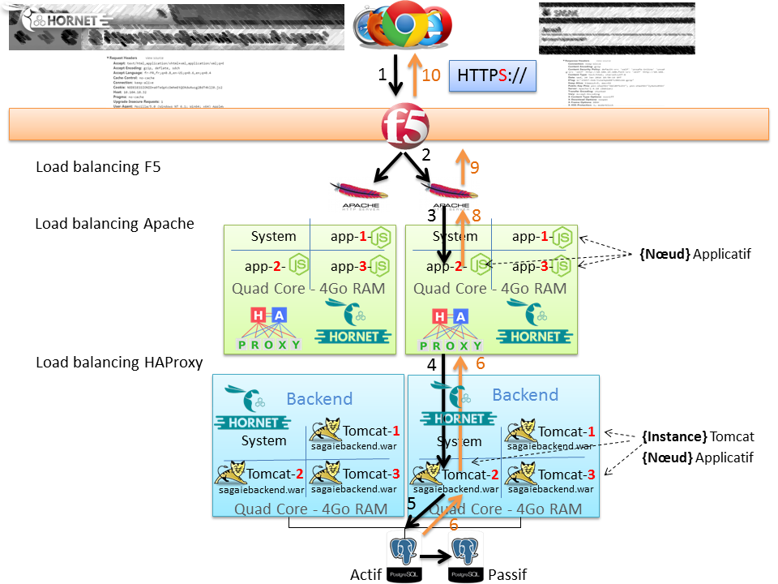

# Infrastructure Haute Disponibilité Hornet.js

L'infrastructure HD : haute disponibilité,  Hornet.js repose sur les points suivant :

- OS : [Debian](https://www.debian.org)
- Serveur Web : [Apache Httpd](https://httpd.apache.org/)
- Serveur d'application : [Nodejs](https://nodejs.org)
- Serveur de service : [Apache Tomcat](http://tomcat.apache.org)
- Base de données : [PostgreSQL](https://www.postgresql.org)

