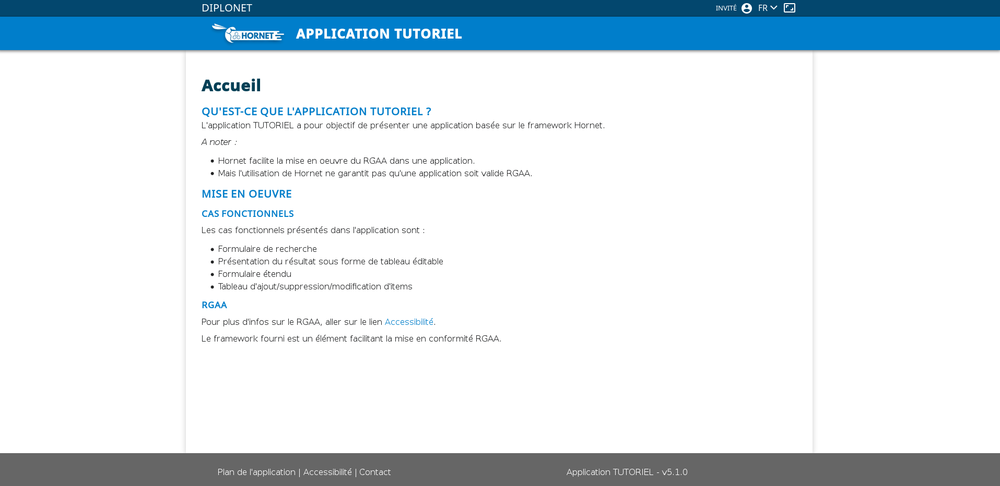

# Applitutoriel

L'application « applitutoriel » a pour objectif de présenter une application basée sur le framework Hornet.

L'application est scindée en deux modules :

- applitutoriel-service (Partie JAVA/Tomcat)
- applitutoriel-js (Partie Javascript/Nodejs)

L’infrastructure nécessaire au bon fonctionnement du projet (systèmes d’exploitation, serveur Web, serveur d’application, JRE à utiliser, du SGBD…) est celle de la filière Hornet.

## Liste des livrables

Ce chapitre décrit les éléments issus de la construction des parties client et serveur.

### Packaging

Le packaging de l’applitutoriel-service est prévu pour un déploiement sur un serveur d’application Apache Tomcat (délivrant la partie dynamique).

Le packaging de l’applitutoriel-js est prévu pour un déploiement sur un serveur d’application NodeJS (délivrant la partie dynamique) et sur un frontal web Apache httpd (délivrant la partie statique).

Le serveur de thèmes mutualisé hornet-themes est livré séparément sur un CDN. (Voir HORNET_SCD_Guide de déploiement des Themes)

### Liste des livrables

- applitutoriel-5.x.x-dynamic.zip
- applitutoriel-5.x.x-static.zip
- applitutoriel-5.x.x-environment.zip

- applitutoriel-service-5.x.x-config.zip
- applitutoriel-service-5.x.x-context.zip
- applitutoriel-service-5.x.x.war

## Configuration pré-déploiement

Ce chapitre décrit les étapes de configuration à effectuer avant le déploiement de l’application applitutoriel.

### Fichier de configuration : production.json

Le fichier `/etc/nodejs/applitutoriel/production.json` contient des données communes aux instances d'application. Ex : le chemin vers le cdn

Les variables seront remplacer par la dépaut.

C'est ce fichier qui doit être mis à jour en priorité pour une installation.

```json
{
  "contextPath": "#{APPLICATION_CONTEXT_ROOT}",
  "localeI18n": {
      "locale": "fr-FR",
      "lang": "fr"
    },
    "cookie": {
      "httpOnly": true,
      "secure": false
    },
    "security": {
      "enabled": true,
      "csp": {
        "enabled": true,
        "connectSrc": [
          "'self'"
        ],
        "scriptSrc": [
          "'self'",
          "'unsafe-inline'",
          "'unsafe-eval'"
        ],
        "styleSrc": [
          "'self'",
          "'unsafe-inline'"
        ],
        "fontSrc": [
          "'self'"
        ],
        "imgSrc": [
          "'self'"
        ],
        "formAction": [
          "'self'"
        ]
      },
        "reportOnly": false
    },
    "logClient": {
      "remote": false,
      "level": "INFO",
      "appenders": {
          "BrowserConsole" : {
               "type": "BrowserConsole",
               "layout": {
                   "type": "THIN"
               }
           }
      }
    },
    "defaultServices": {
      "host": "#{DEFAULT_SERVICE_HOST}",
      "name": "#{SERVICE_CONTEXT_ROOT}"
    },
    "secteursServices": {
      // configuration multi-service : exemple de definition d'un service specifique pour les secteurs
      "host": "#{DEFAULT_SERVICE_HOST}",
      "name": "#{SERVICE_CONTEXT_ROOT}"
    },
    "antivirus" : {
      "host" : "localhost",
      "port" : 3310,
      "timeout" : 60000
    },
    "mail": {
      "config": {
        "host": "#{MAIL_HOST}",
        "port": #{MAIL_PORT},
        "secure": #{MAIL_SECURE},
        "connectionTimeout": #{MAIL_TIMEOUT},
        "tls": {
          "rejectUnauthorized": #{MAIL_TLS_REJECT}
        },
        "auth": ""
      },
      "mailReceiver": "#{MAIL_RECEIVER}",
      "mailSender": "#{MAIL_SENDER}"
    },
    "mock": {
         "enabled": false,
         "servicePage": {
           "enabled": false
         },
         "serviceData": {
           "enabled": false
         }
    },
    "fullSpa": {
      "enabled": false
    },
    "request": {
        "cache": {
          "enabled": false
        }
    }
}
```

#### Configuration générale

| Paramètre | Description | Valeur |
|-----------|-------------|--------|
|contextPath| Context de l'application déployée|Par défaut vide|


```json
{
  "contextPath": "applitutoriel",
  ...
}
```

#### configuration I18n

| Paramètre | Description | Valeur |
|-----------|-------------|--------|
|locale| Locale de l'application |
|lang| Language de l'application |

```json
{
 "localeI18n": {
       "locale": "fr-FR",
       "lang": "fr"
     }
}
```

#### Configuration Cookie

Cette partie contient l'ensemble du paramétrage des cookies de session

| Paramètre | Description | Valeur |
|-----------|-------------|--------|
|httpOnly|Cookie accessible uniquement par la couche HTTP et non accessible par du javascript|true|
|secure| Laisse la décision d’envoi ou non du cookie au navigateur (false: le navigateur enverra le cookie dans tous les cas)| false |

```json
  "cookie": {
    "httpOnly": true,
    "secure": false
  }
```

#### Configuration de la sécurité

Ce bloc contient l'ensemble des paramètres destinés à la configuration de helmet.

| Paramètre | Description | Valeur |
|-----------|-------------|--------|
|enabled| Activation de la sécurité | true |
|csp.scriptSrc|Noms de domaine des différentes ressources de scripts du site| ["'self'", "'unsafe-inline'", "'unsafe-eval'"]|
|csp.styleSrc|Noms de domaine des différentes ressources de css du site | ["'self'", "'unsafe-inline'"]|
|csp.fontSrc|Noms de domaine des différentes ressources de fonts du site| ["'self'", {hostname}]|
|csp.imgSrc|Noms de domaine des différentes ressources d'images scripts du site | ["'self'", {hostname}]|
|csp.formAction|Noms de domaine des différentes ressources HTML du site | ["'self'"]|
|csp.reportOnly| Si valorisé à true, génération d'un rapport d'erreur uniquement | false |


```json
 "security": {
      "enabled": true,
      "csp": {
        "enabled": true,
        "connectSrc": [
          "'self'"
        ],
        "scriptSrc": [
          "'self'",
          "'unsafe-inline'",
          "'unsafe-eval'"
        ],
        "styleSrc": [
          "'self'",
          "'unsafe-inline'"
        ],
        "fontSrc": [
          "'self'"
        ],
        "imgSrc": [
          "'self'"
        ],
        "formAction": [
          "'self'"
        ]
      },
        "reportOnly": false
    }
```

#### Configuration des logs client

| Paramètre | Description | Valeur |
|-----------|-------------|--------|
|remote| Logger sur un ordinateur distant | false |
|level|Niveau de log|INFO|
|appenders.type|Type d'appender | &nbsp; |
|appenders.layout.type| Type d'affichage des messages|THIN/BASIC/pattern/...|

```json
"logClient": {
      "remote": false,
      "level": "INFO",
      "appenders": {
          "BrowserConsole" : {
               "type": "BrowserConsole",
               "layout": {
                  "type": "THIN"
               }
           }
      }
    }
```

#### Configuration des services

| Paramètre | Description | Valeur |
|-----------|-------------|--------|
|defaultServices.host| URL de déploiement du module applitutoriel-service| [Protocol]://[host]:[port] |
|defaultServices.name| Nom de déploiement des services|applitutoriel|

```json
  "defaultServices": {
    "host": "http://localhost:8080/",
    "name": "applitutoriel-service"
  },
```

#### Configuration de l'antivirus

| Paramètre | Description | Valeur |
|-----------|-------------|--------|
|host| URL de déploiement | &nbsp; |
|port| Port de déploiement| &nbsp; |
|timeout|Timeout des réponses| &nbsp; |

```
"antivirus" : {
      "host" : "localhost",
      "port" : 3310,
      "timeout" : 60000
    },
```

### Configuration des mails

| Paramètre | Description | Valeur |
|-----------|-------------|--------|
|config| Configuration du server de mail | &nbsp; |
|config.host| URL de déploiement | &nbsp; |
|config.port| Port de déploiement | &nbsp; |
|config.secure| Laisse la décision d’envoi ou non du cookie au navigateur (false: le navigateur enverra le cookie dans tous les cas)| false |
|config.connectionTimeout|Timeout de connexion | &nbsp; |
|config.tls.rejectUnauthorized| Indique si l'identité du serveur doit être vérifiée | &nbsp; |
|condif.auth| Authentification | &nbsp; |
|mailReceiver| Receveur du mail | &nbsp; |
|mailSender| Expéditeur du mail | &nbsp; |


```
"mail": {
  "config": {
    "host": "#{MAIL_HOST}",
    "port": #{MAIL_PORT},
    "secure": #{MAIL_SECURE},
    "connectionTimeout": #{MAIL_TIMEOUT},
    "tls": {
      "rejectUnauthorized": #{MAIL_TLS_REJECT}
    },
    "auth": {
        "user": "applituto",
        "pass": "applituto"
    }
  },
  "mailReceiver": "#{MAIL_RECEIVER}",
  "mailSender": "#{MAIL_SENDER}"
},
```

#### Mode mock

| Paramètre | Description | Valeur |
|-----------|-------------|--------|
|enabled|Activation du mode mock de l'application|false|
|mock.servicePage.enabled| Bouchon des services pages |false|
|mock.serviceData.enabled| Bouchon des services data|false|

```json
 "mock": {
  "enabled": false,
  "servicePage": {
    "enabled": false
  },
  "serviceData": {
    "enabled": false
  }
}
```

#### Mode full SPA

| Paramètre | Description | Valeur |
|-----------|-------------|--------|
|enabled|Activation du mode full SPA de l'application|false|

```
"fullSpa": {
  "enabled": false
}
```

#### Configuration du cache

| Paramètre | Description | Valeur |
|-----------|-------------|--------|
|enabled|Activation du cache de l'application|false|

```
"request": {
    "cache": {
      "enabled": false
    }
}
```

### Fichier de configuration par instance : production-INSTANCE.json

Ce fichier n'est pas obligatoire dans le cas d'un mode mono-instance. Dans ce cas précis, il faut reporter toutes les modifications sur le production.json.

Dans le cas d'un mode cluster, il faut créer autant de fichier qu'il y a d'instance.

ex : `/etc/nodejs/applitutoriel/production-1.json`

Ceci s'explique par la configuration spécifique par instance : port, route, port de monitoring

```json
{
  "server":{
    "route": "js1",
    "port":8888,
    "portMonitor": 9999,
    "uploadAntivirus": false
  }
}
```

### Fichier de configuration des logs par instance : log4js-INSTANCE.json

Ce fichier est obligatoire pour que l'application démarre.

ex : `/etc/nodejs/applitutoriel/log4js-1.json`

```json
{
  "appenders": {
    "console": {
      "type": "console",
      "layout": {
        "type": "pattern",
        "pattern": "%[%d{ISO8601}|%x{tid}|%x{user}|%p|%c|%x{fn}|%m%]"
      }
    }
    "dateFile": {
      "type": "dateFile",
      "pattern": ".yyyy-MM-dd",
      "filename": "log/{#INSTANCE_NAME}.log", //DEV
      "layout": {
        "type": "pattern",
        "pattern": "%d{ISO8601}|%x{tid}|%x{user}|%p|%c|%x{fn}|%m"
      },
      "compress": true,
      "keepFileExt": true
    }
  },
  "categories": {
    "default": { "appenders": ["console" , "dateFile", "level": "INFO" }
  }
}
```

## Déploiement

Ce chapitre décrit les différentes étapes nécessaires au déploiement des deux modules de l’application applitutoriel.


### Frontal Apache Nodejs

Arrêter le service:

```shell
systemctl stop apache2
```

Configurer le virtual host.

Exemple de configuration :

```xml
<Proxy balancer://balancer-applitutoriel>

	BalancerMember http://127.0.0.1:8888 route=js1 retry=30 keepalive=on  ttl=10 loadfactor=3 flushpackets=auto timeout=300
	BalancerMember http://127.0.0.1:8889 route=js2 retry=30 keepalive=on  ttl=10 loadfactor=3 flushpackets=auto timeout=300
	BalancerMember http://127.0.0.1:8890 route=js3 retry=30 keepalive=on  ttl=10 loadfactor=3 flushpackets=auto timeout=300

	Require all granted
</Proxy>

AliasMatch ^/applitutoriel/static([^/]+)/(.*)$ /var/www/applitutoriel/static/$2

ProxyPassMatch ^/applitutoriel/static !
ProxyPass /applitutoriel balancer://balancer-applitutoriel/applitutoriel stickysession=NODESESSIONID nofailover=on
```

Redémarrer le service:

```
systemctl start apache2
```

### Serveur NodeJS

Arrêter le service:

```shell
systemctl stop applitutoriel*
```

Se positionner dans le répertoire d'installation de l'application :

Dézipper le livrable :

```shell
unzip applitutoriel-5.x.x.dynamic.zip /var/lib/nodejs/applitutoriel
```

Appliquer la configuration des fichiers : `/etc/nodejs/applitutoriel`

- environnement
- production.json
- production-1.json
- production-X.json
- log4js-1.json
- log4js-X.json

Redémarrer le service:

```shell
systemctl restart applitutoriel*
```

### Frontal Apache Tomcat 8

Arrêter le service:

```shell
systemctl stop apache2
```

Configurer le virtual host.

Exemple de configuration :

```xml
<Proxy balancer://balancer-applitutoriel-service>
	BalancerMember http://127.0.0.1:8080 route=jvmIDJVM-1 retry=30 keepalive=on ttl=10 loadfactor=3 flushpackets=auto timeout=300
	BalancerMember http://127.0.0.1:8081 route=jvmIDJVM-2 retry=30 keepalive=on ttl=10 loadfactor=3 flushpackets=auto timeout=300
	BalancerMember http://127.0.0.1:8082 route=jvmIDJVM-3 retry=30 keepalive=on ttl=10 loadfactor=3 flushpackets=auto timeout=300

	Require all granted
</Proxy>

ProxyPass /applitutoriel-service balancer://balancer-applitutoriel/applitutoriel-service nofailover=on
```

Redémarrer le service:

```shell
systemctl start apache2
```

### Serveur Tomcat

Arrêter le service:

```shell
systemctl stop tomcat8
```

Déposer les fichiers de configurations à l’emplacement indiqué dans le fichier de paramétrage du contexte de l’application (variable `conf/applitutorielprop`).

```shell
unzip applitutoriel-service-5.x.x-config.zip /etc/tomcat8/appli/applitutoriel-service
```

Déposer le fichier de paramétrage du contexte de l’application dans le répertoire du serveur Tomcat situé sous : `/etc/tomcat8/Catalina/localhost/`

```xml
<Context useHttpOnly="true">
    <Environment name="conf/applitutorielprop" value="/etc/tomcat8/appli/applitutoriel-service" type="java.lang.String" />
</Context>
```

Déployer le war sur le serveur applicatif :

- `applitutoriel-service-5.x.x.war`

Renommer le fichier en `applitutoriel.war` avant de le déposer dans le répertoire tomcat 8 : `/var/lib/tomcat8/webapps`

Redémarrer le service

```shell
 systemctl start tomcat8
```

## Vérification

Ce chapitre décrit les actions à mener afin de vérifier que l’application applitutoriel a été correctement installée et configurée.


### Serveur Tomcat

Accès à l’application :

- Saisir l’url `[PROTOCOLE]://[HOST]:[PORT]/applitutoriel-service/secteurs` dans un navigateur web.

Le résultat doit ressembler à ceci :

```json
[
    {
        "auteurCreat": "user",
        "dateMajEnreg": 1331895600000,
        "auteurMajEnreg": "user",
        "dateSupprEnreg": null,
        "auteurSupprEnreg": null,
        "nom": "Habillement",
        "desc": "Secteur de l'habillement"
    },
    {
        "id": 4,
        "dateCreat": 1331809200000,
        "auteurCreat": "user",
        "dateMajEnreg": 1331895600000,
        "auteurMajEnreg": "user",
        "dateSupprEnreg": null,
        "auteurSupprEnreg": null,
        "nom": "Santé",
        "desc": "Secteur de la santé"
    },
    {
        "id": 5,
        "dateCreat": 1331550000000,
        "auteurCreat": "user",
        "dateMajEnreg": 1331636400000,
        "auteurMajEnreg": "user",
        "dateSupprEnreg": null,
        "auteurSupprEnreg": null,
        "nom": "Sport",
        "desc": "Secteur du sport"
    }
]
```

### Serveur NodeJS

Accès à l’application :

- Saisir l’url `[PROTOCOLE]://[HOST]:[PORT]/applitutoriel` dans un navigateur web et vérifier l'affichage suivant :



