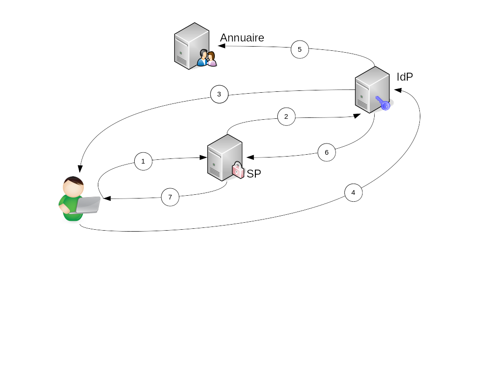

# SAML

## Préambule

Le SAML « Security Assertion Markup Language » est un protocole ouvert et standardisé basé sur le langage XML pour échanger des informations d’authentification et d’autorisation entre des entités ou domaines de sécurité.
Le SAML va gérer à la fois le format du message XML, appelé assertion, ainsi que les renseignements nécessaires à l’authentification et le process d’échange entre deux grands partenaires :

- Le SP (Service Provider) ou fournisseur de service, qui protège l'accès aux ressources demandées (l'application) en appliquant une politique de sécurité. Par exemple, il bloque tout accès à un utilisateur non authentifié et le dirige vers son fournisseur d'identité.
- L'IdP (Identity Provider) est le fournisseur d'identité qui répond à la demande du SP. Il est chargé d'authentifier l'utilisateur et de forger la réponse contenant les informations associées à l’identité (groupe en général) et demandées par le SP.

1.  Accès de l’utilisateur à l’application, le SP* détecte l’accès à une ressource sécurisée.
2.  Le SP génère une demande d’authentification et renvoie la demande et l’utilisateur vers l’IdP**.
3.  L’utilisateur n’étant pas connecté, l’IdP redirige vers un écran d’authentification
4.  L’IdP authentifie l’utilisateur
5.  L’IdP collecte les informations utiles de l’utilisateur (nom, prénom, ...)
6.  L’IdP renvoie la réponse d’authentification et l’utilisateur vers le SP. La réponse contient:
Des informations sur l'utilisateur
La liste des profils alloués à l'utilisateur pour l'application cliente.
7.  Le SP vérifie la réponse de l’IdP et donne accès à la ressource demandée par l’utilisateur.

&#42; SP: Service Provider ou fournisseur de service, protège l'accès aux ressources demandées (l'application) en appliquant une politique de sécurité. Par exemple, il bloque tout accès à un utilisateur non authentifié et le dirige vers son fournisseur d'identité.

&#42;&#42; IdP: Identity Provider - fournisseur d'identité répondant à la demande du SP. Il est chargé d'authentifier l'utilisateur et de forger la réponse contenant les informations associées à l’identité (groupe en général) et demandées par le SP.

## Plus d'informations

[Page wiki SAML](https://cognitium.forge.dsinet.diplomatie.gouv.fr/wiki/index.php/SAML)
