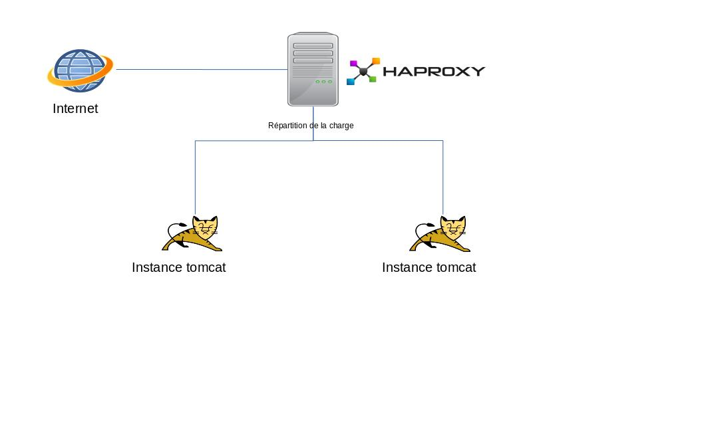

# Installation de Haproxy

Haproxy est un utilitaire permettant la répartition de charge (load balancing) d'un service réseau (HTTP ou TCP, etc...)
vers d'autres processus diposant du même services afin d'améliorer les accès à ce dernier.




## L'installation du service Haproxy

Récupération et installation du paquet haproxy version 1.7.5.2

```shell
apt-get install haproxy
```

Si la commande ne fonctionne pas, suivre la procédure suivante: https://haproxy.debian.net/#?distribution=Debian&release=stretch&version=1.7

Commande d'arrêt et de démarrage du service:

```shell
#arret
service  haproxy stop

#demarrage
service  haproxy start
```

## La configuration

Editer le fichier de configuration /var/etc/haproxy/haproxy.cfg

Le fichier est structuré en section

- global: Section commune à toutes les autres sections.
- defaults: Section contenant les paramètres par défaut qui seront communs à toutes les sections.
- frontend <name> : Section pemertant de définir les règles d'écoute du proxy
- backend <name> : Section decrivant les paramètres serveurs auquel se connectera le proxy
- listen <name> : Permet de regrouper toutes les directives du frontend et du backend


Pour plus de détails se référer à la [documentation](http://cbonte.github.io/haproxy-dconv/1.7/configuration.html)

##### Exemple de configuration

On souhaite associer 3 instances de tomcat (service backend) pour l'application applitutorieljs

```
global
        log /dev/log    local0
        log /dev/log    local1 notice
        chroot /var/lib/haproxy
        stats socket /run/haproxy/admin.sock mode 660 level admin
        stats timeout 30s
        user haproxy
        group haproxy
        daemon

defaults
        log     global
        mode    http
        option  httplog
        option  httpclose
        option  dontlognull
        option  redispatch
        maxconn 2000
        balance roundrobin
        timeout connect 5000
        timeout client  50000
        timeout server  50000

#Point d'entrer du HaProxy sur le port 81
frontend applitutorieljs
        bind *:81
        # Indique quel backend utilisé par défaut
        default_backend applituto_backend_service

        log /dev/log/ local1 warning
        #syntaxe si l'on souhaite personnaliser les logs
        log-format "[%t] -%b  %r "

#Liste des serveurs tomcat utilisés
backend applituto_backend_service
        server backend_service1 <IP des instance tomcat>:8081 check
        server backend_service2 <IP des instance tomcat>:8082 check
        server backend_service3 <IP des instance tomcat>:8083 check
        stats enable
        stats hide-version
        stats uri /stats
        stats refresh 5s
```

La même règle peut être écrit de cette manière:

```
listen haproxy
    bind *:81
    mode http
    balance roundrobin
    server backend_service1 <IP des instance tomcat>:8083 check
    server backend_service2 <IP des instance tomcat>:8083 check
    server backend_service3 <IP des instance tomcat>:8083 check
    stats enable
    stats hide-version
    stats uri /stats
    stats refresh 5s
```


Modifier l'adresse des services dans l'application, dans le fichier de default.conf:
```
"defaultServices": {
    "host": "adresse du haproxy",
    ...
 },
 "secteursServices": {
     // configuration multi-service : exemple de definition d'un service specifique pour les secteurs
     "host": "adresse du haproxy"
   }
```