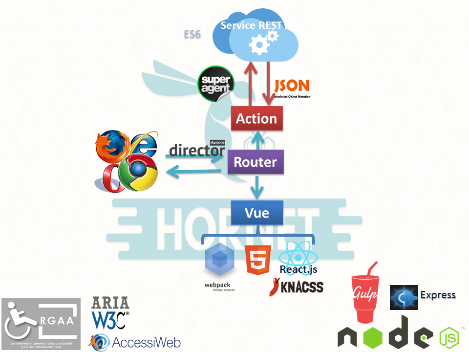
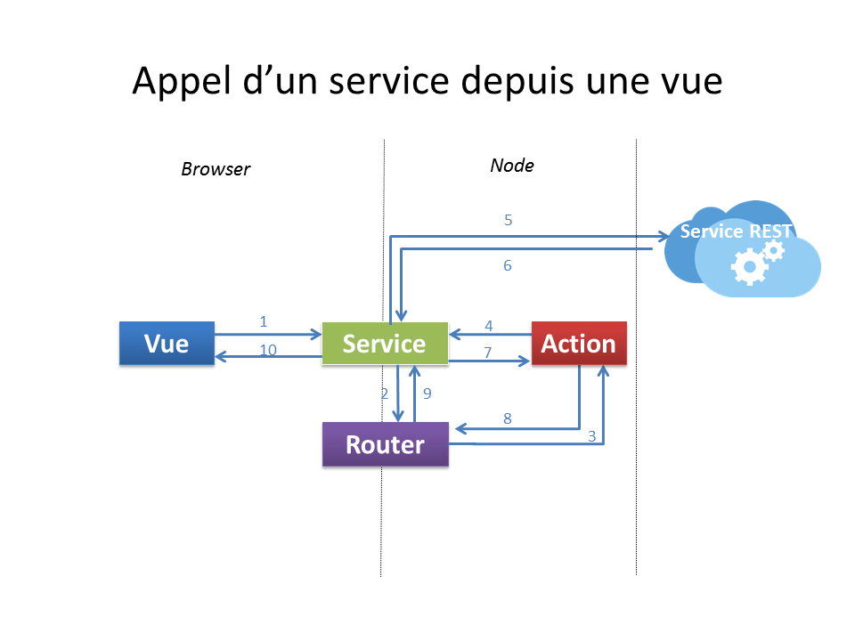
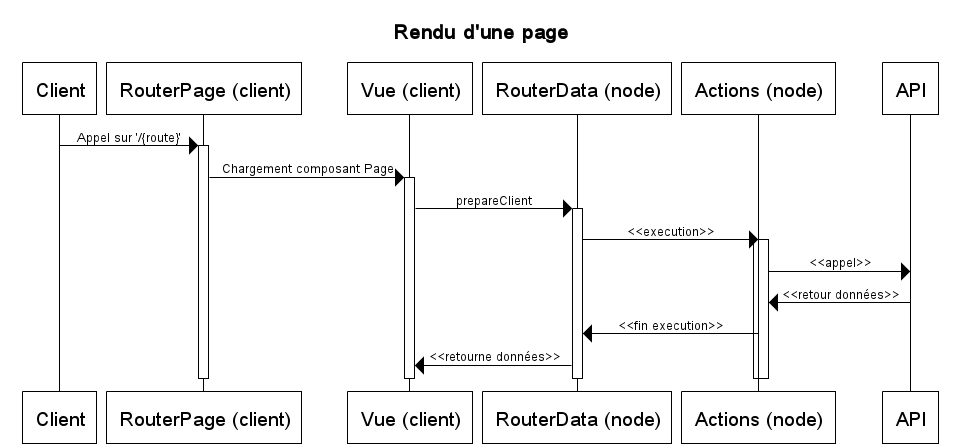

# Hornet-js




Les composants techniques du framework : 

* `Node.js` : plate-forme logicielle d'exécution du code JavaScript côté serveur 
* `Express` : bibliothèque de base pour l'écriture d'application web sur Node.js 
* `Director` : composant de gestion du routage des urls sur le serveur 
* `React` : bibliothèque de création d'IHM html selon une logique orientée composants 
* `Superagent` : composant JavaScript pour l'exécution d'appels http 
* `Webpack` : outil de création de paquetages (JavaScript, CSS, ...) pour les navigateurs web 
* `Gulp` : outil pour la création de tâches de développement


## Prérequis

* NodeJS 8.9.x
* hornet-js-builder 1.4.0 installé en global:

```shell
npm install -g hornet-js-builder
```

## Initialisation

Récupérer les sources du projet.

Compiler les sources typescript de `hornet.js`

```shell
hb compile
```

## Utilisation dans un projet

Ajouter au package.json

```shell
"tsDefinitionDependencies": {
  "hornet-js-ts-typings": "5.1.X",
  "hornet-js-utils-dts": "5.1.X",
  "hornet-js-core-dts": "5.1.X",
  "hornet-js-components-dts": "5.1.X"
},
  "appDependencies": {
  "hornet-js-components": "5.1.X",
  "hornet-js-core": "5.1.X",
  "hornet-js-ts-typings": "5.1.X",
  "hornet-js-utils": "5.1.X"
}
```

Puis lancer la commande : 

```shell
hb install
```

## Pattern d’architecture

Le schéma ci-dessous explique les responsabilités dans les grandes lignes de chaque élément.




### <a id="Routeur"></a> Routeur

Ce composant est le point central de la navigation. Il permet de gérer de manière identique la navigation au sein de l’application que ce soit côté client ou côté serveur (nodeJs).

Ce composant est configuré à partir d’un ensemble de « routes » qui viennent faire le lien entre une URL et les actions du pattern décrit ci-dessus.

Le routeur Hornet s'appuie sur le composant [Director](https://github.com/flatiron/director).

Le routeur se décline en 2 parties:

* routerPage: permet de router vers le composant Page associé à la route appelée
* routerData: permet d'exécuter l'action associée à la route appelée

### Services

Un service 
Pour un composant Page donné, est défini un service, au niveau du routeur. 

### Actions

Les actions portent les traitements de l’application. Leur réalisation est à la charge du développeur de l’application.

Les services externes sont appelés depuis les api afin d’effectuer les traitements demandés par l’utilisateur. Les retours des services externes sont transmis aux actions qui, elles mêmes, les re-dispatchent à la vue.


### Vues

Les vues sont les composants servant à produire le code html affiché à l'utilisateur.

Les données permettant d'alimenter la vue doivent être récupérées en utilisant la méthode  `getService` du composant page, au sein de la méthode `prepareClient`. 
La méthode `prepareClient` est déclenchée lorsque le composant Page est monté (à travers la méthode `componentDidMount` propre au [cycle de vie React](https://facebook.github.io/react/docs/react-component.html)).


Les composants de cette brique utilisent le moteur de rendu [React](http://facebook.github.io/react/) :

* Un rendu des composants à partir d’un template JSX/TSX/JavaScript
* Une gestion des évènements permettant un binding unidirectionnel (vue -> modèle).

Les composants graphiques sont implémentés avec la librairie React et les contrôles de surface des formulaires sont décrits avec [ajv](https://github.com/epoberezkin/ajv) 

## Diagrammes de séquence

Ci-dessous sont présentés les schémas généraux de déroulements des échanges dans le pattern implémenté dans Hornet en mode SPA (navigateur web) et rendu serveur (serveur NodeJS).

### Suite des actions pour le rendu côté serveur


### Suite des actions pour le rendu côté client



